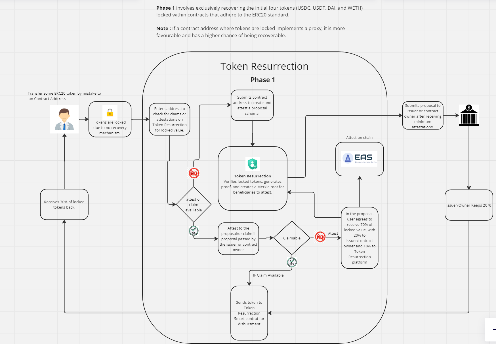

# Token Resurrection

## Index

- [Token Resurrection](#token-resurrection)
  - [Index](#index)
  - [Overview](#overview)
  - [Problem Statement](#problem-statement)
  - [Solution Details](#solution-details)
    - [Verification and Proof Generation](#verification-and-proof-generation)
    - [Recovery Process](#recovery-process)
  - [Benefits](#benefits)
  - [Project flow](#project-flow)
  - [Challenges Faced](#challenges-faced)
    - [Creating Strong Verification Logic](#creating-strong-verification-logic)
    - [Data Collection and Analysis](#data-collection-and-analysis)
    - [Implementation Issues with Merkle Root](#implementation-issues-with-merkle-root)
  - [Contract Address](#contract-address)

## Overview

Token Resurrection addresses the issue of tokens being lost when mistakenly transferred to contract addresses. This solution aims to recover these tokens through a structured process involving verification, attestation, and recovery proposal submission. 🔄

## Problem Statement

Currently, there is no means to connect with the issuer and build a community around these lost tokens.Tokens transferred to contract addresses are often irretrievable, leading to permanent loss for users. Token Resurrection provides a mechanism to recover such tokens, benefiting users, issuers, and the platform facilitating the recovery process. 🛠️

## Solution Details

### Verification and Proof Generation

Token Resurrection verifies locked tokens and generates proof of ownership. A Merkle root is created for beneficiaries to attest their ownership using the Ethereum Attestation Service (EAS). 🌱

### Recovery Process

1. **Submission**: Users initiate recovery proposals detailing their locked token transactions.
2. **Approval**: Proposals are submitted to issuers or contract owners for approval.
3. **Disbursement**: Upon approval, tokens are distributed:
   - Users receive 70% of locked tokens. 💼
   - Issuers receive 20%. 📈
   - Token Resurrection retains 10% for facilitation. 🔄

## Benefits

- **Auditing and Transparency**: Introduces concepts like Gross and Net Circulating Supply, enhancing transparency for token issuers. 📊
- **Community Engagement**: Increases trust and loyalty within decentralized autonomous organizations (DAOs) by facilitating token recovery for their communities. 🌐

## Project flow

## Challenges Faced

### Creating Strong Verification Logic

Developing robust logic to verify contract addresses holding locked tokens was challenging but essential for accurate recovery.

### Data Collection and Analysis

Intensive research into locked tokens for five cryptocurrencies was required to compile accurate user lists and token amounts.

### Implementation Issues with Merkle Root

Integration of Merkle root creation with EAS in the resolver contract encountered decoding issues, requiring two days of debugging for resolution.

## Contract Address

[Token Resurrection Contract Address](https://sepolia.basescan.org/address/0x352349c1aF3f45faed79AEF9dA762BAEE02363cc#code)

Despite challenges, our solution's feasibility and benefits were validated through comprehensive data analysis and implementation efforts. 🚀
