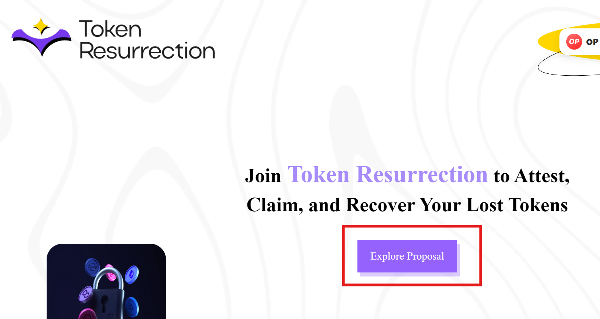
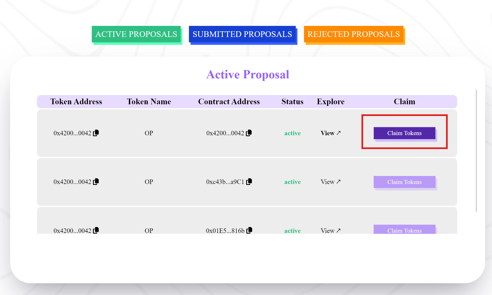
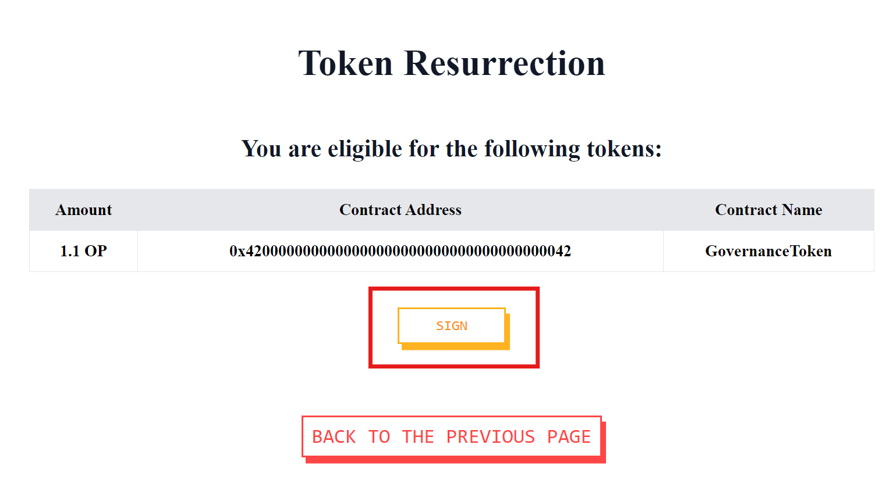
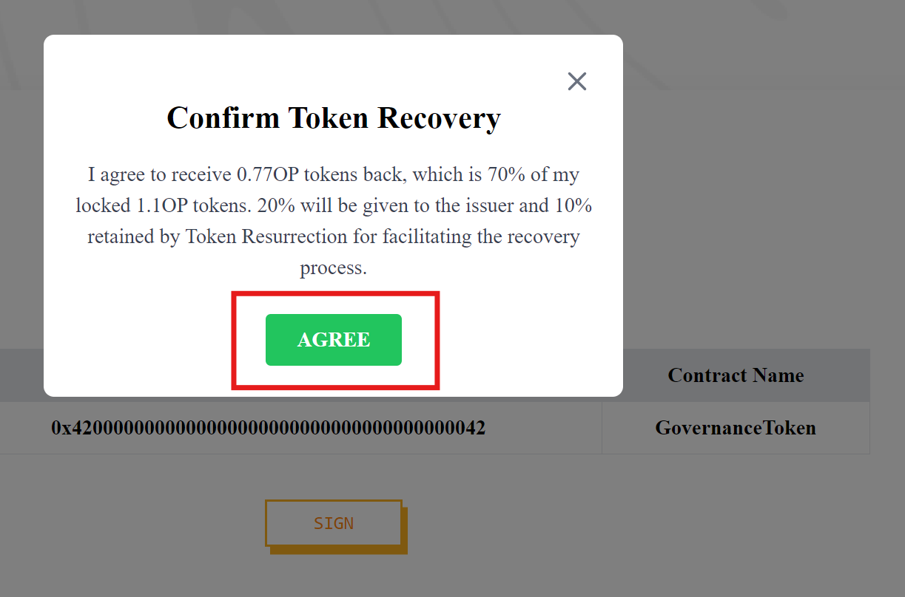
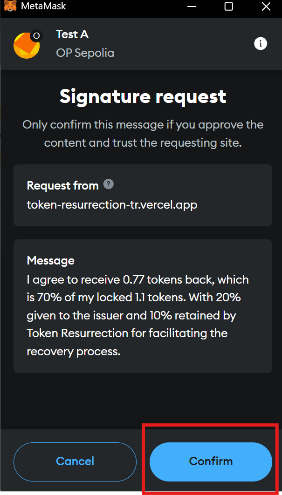
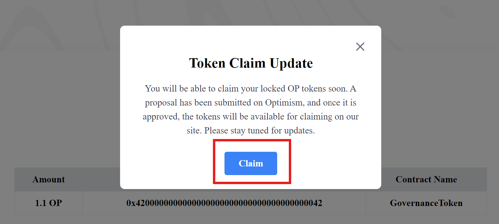

# Token Resurrection User Guide

This guide will walk you through the steps to claim your locked tokens via the Token Resurrection platform. Please follow each step carefully to ensure a smooth process.

---

## Step 1: Access the Platform

1. Open your browser and visit **[Token Resurrection](https://token-resurrection-tr.vercel.app)**.
2. Connect your wallet by selecting your preferred wallet provider (e.g., MetaMask, WalletConnect).
3. Once your wallet is successfully connected, click the **"Explore Proposal"** button on the homepage.

---

## Step 2: Review Active Proposals

1. After clicking **"Explore Proposal"**, you will be taken to a page displaying a list of active proposals where your Optimism (OP) tokens are currently locked.
2. At this stage, you can only claim tokens sent to the OP contract address: **0x4200000000000000000000000000000000000042**.

---

## Step 3: Claim Your Tokens

1. To proceed with claiming your tokens, click the **"Claim Tokens"** button. You will be redirected to the `/check` page.
2. On this page, you will see the total amount of tokens locked in the contract.
3. Carefully review the displayed information, then click **"Sign"** to acknowledge and agree to the terms and conditions (T&C).

---

## Step 4: Accept Terms and Conditions

1. After clicking "Sign," a pop-up will appear, asking you to accept the platform’s terms and conditions.
2. Review the T&C thoroughly and click **"Accept"** to proceed.

---

## Step 5: Sign the Agreement

1. A signature request will be prompted from your wallet. This signature confirms your acceptance of the terms and conditions—it is NOT a transaction that involves any loss of funds.
2. Click **"Sign"** in your wallet to agree and proceed.

---

## Step 6: Claim Your Tokens

1. Once the T&C is signed, you will be able to finalize the process and claim your locked tokens.
2. Follow the on-screen instructions to complete the claim. Once successful, your tokens will be unlocked and available in your connected wallet.

---

### Important Notes:

- Signature doesn't cost you any gas and there's no risk for any funds loss.
- Make sure you have enough gas fees in your wallet for the token claim transaction.
- The claim process does not deduct any tokens from your wallet; it only unlocks tokens currently held in the contract.
